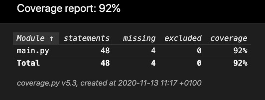

# The CSV to SQLite converter

## Table of contents:
#### * General info
#### * Technologies 
#### * Tests
#### * Setup
#### * Status

## **General info**:

### 1. Motivation
Since it's hard to find SQL dataset suitable for data analysis, I created a program that converts CSV dataset to SQL one. It's worthy because operating on big datasets is much faster with SQL rather than CSV, especially, when you want to work only on the part of the dataset. Hence below algorithm certainly will be of service to me.

The second reason for writing such algorith is a desire to play with a SQL dataset.

### 2. Dataset explanation
The dataset Students I will work on is downloaded from *UCI Machine Learning Repository*.

In brief: This data approach student achievement in secondary education of two Portuguese schools. The data attributes include student grades, demographic, social and school related features) and it was collected by using school reports and questionnaires. The dataset is provided regarding the performance in subject mathematics.

Important note: 
*The target attribute G3 has a strong correlation with attributes G2 and G1. This occurs because G3 is the final year grade (issued at the 3rd period), while G1 and G2 correspond to the 1st and 2nd period grades. It is more difficult to predict G3 without G2 and G1, but such prediction is much more useful (see paper source for more details).*

### 3. Basic algorithm explanation
The algorithm mainly needs only one thing - CSV dataset that will be put in functions below as an argument. Some of them returns SQL statements that are executed.
* ```get_table_name(csv_file)``` <-- returns proper table name (or generate new one almost randomly) that is allowed by sqlite3 documentation. 
* ```create_table(df_dataset, table_name)``` <-- creates column names with corresponsing data types and returns SQL statement, for example ```CREATE TABLE "students" ("school" TEXT, ...);```
* ```drop_table_if_exists(table_name)``` <-- returns ```DROP TABLE IF EXISTS "students";```
* ```insert_into_values(df_dataset, table_name)``` <-- returns ```INSERT INTO "students" VALUES (?,?,?, ...);```. Then question marks will be replaced by values in function ```executemany()```.
* ```convert_to_str(df_dataset)``` <-- the function converts problematic pandas datatypes like datetime or timedelta to be interpreted by sqlite as strings.
* ```executemany(df_dataset, table_name)``` <-- executes ```insert_into_values()``` function.


#### You can find more explanation in [my Kaggle's notebook](https://www.kaggle.com/paulinakas/convert-csv-to-sql). 


## **Technologies**:
* Python 3.8.1
* Pandas 1.1.0
* Pytest 6.1.1
* [Coverage 5.3](https://coverage.readthedocs.io/en/latest/)

## **General info**:
The program (file main.py) has been tested using ```Pytest``` framework. I decided to use it because I wanted to get to know a new testing framework (previously I worked on ```unittest```). Coverage report I got shows 92%. 



## **Setup**:

In case you would like to clone this repository, please know that my operating system is macOS 10.14.6. 

## **Status**:
Finished for now.
